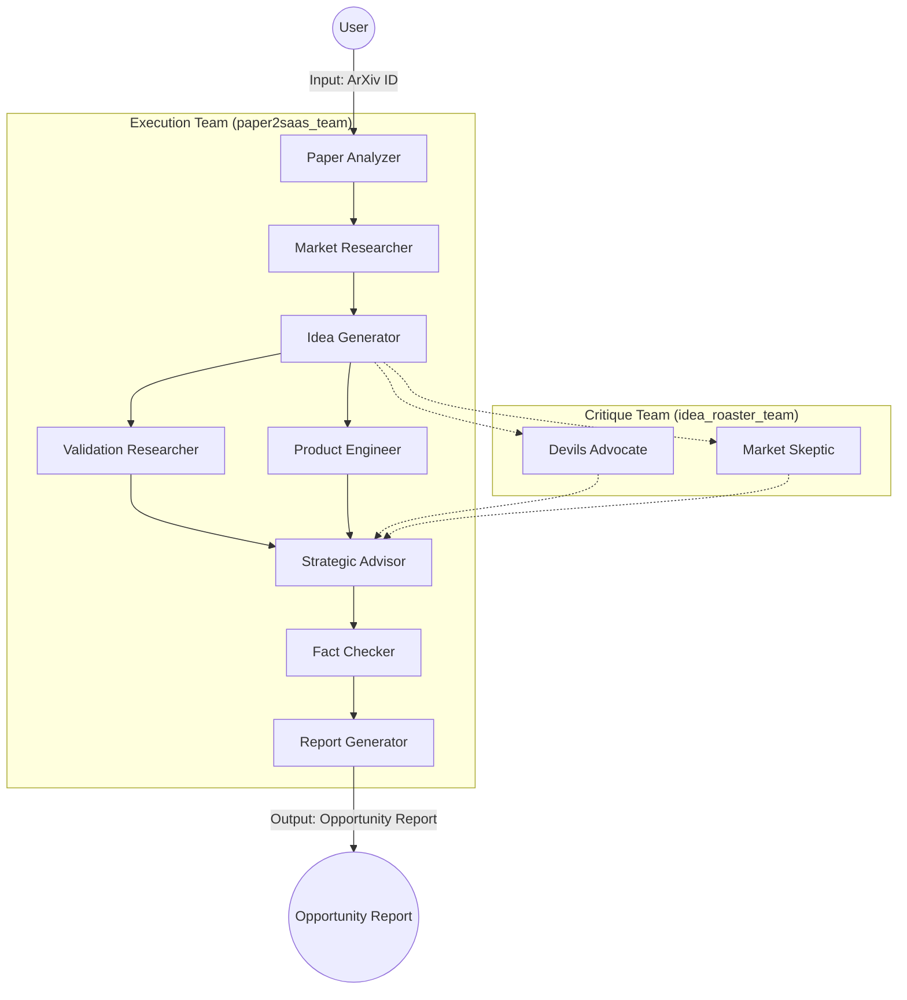

# 🧪 Paper2SaaS

[](https://www.python.org/downloads/release/python-3120/)
[](https://github.com/agnohq/agno)
[](https://opensource.org/licenses/MIT)

**Transform academic arXiv papers into validated SaaS business opportunities using a multi-agent AI factory.**

---

## 📖 Table of Contents
- [Overview](#-overview)
- [Key Features](#-key-features)
- [Architecture](#-architecture)
- [Methodology](#-methodology)
- [Setup](#-setup)
- [Usage](#-usage)
- [Python Package Details](#-python-package-details)
- [Project Principles](#-project-principles)

---

## 🎯 Overview

Paper2SaaS bridges the gap between theoretical academic research and commercial application. By leveraging a team of specialized AI agents, the platform automates the discovery, ideation, and validation process required to turn complex research papers into actionable business plans.

---

## ✨ Key Features

- 🕵️ **Intelligent Paper Analysis**: Deep parsing of arXiv papers with multi-tool fallback (Arxiv → Semantic Scholar).
- 💡 **Automated Brainstorming**: Generates unique SaaS product concepts based on core research innovations.
- ✅ **Rigorous Validation**: Real-time market research, competitor analysis, and patent risk assessment.
- 📋 **Technical Roadmap**: Detailed implementation plans, including suggested GitHub repos and MVP timelines.
- 🛠️ **Anti-Hallucination Protocol**: Enforced structured outputs and multi-step verification (Chain-of-Note, Chain-of-Verification).
- 🖥️ **Reactive UI**: Modern Next.js interface with real-time streaming of agent reasoning and Claude-style artifacts.

---

## 🏗️ Architecture

Paper2SaaS employs an orchestration pattern with a primary execution team and a secondary critique team to ensure high-quality, verified results.

### Multi-Agent Workflow



### Specialized Agents

| Agent | Role | Focus |
| :--- | :--- | :--- |
| **Paper Analyzer** | Discovery | Fetches and summarizes core research innovations. |
| **Market Researcher** | Analysis | Identifies market gaps and target audience pain points. |
| **Idea Generator** | Ideation | Synthesizes research and market needs into SaaS concepts. |
| **Validation Researcher** | Evidence | Searches for competitors, funding, and real-world demand. |
| **Product Engineer** | Engineering | Scopes the MVP and technical stack. |
| **Strategic Advisor** | Evaluation | Scores ideas based on feasibility and market potential. |
| **Devils Advocate** | Critique | Challenges technical assumptions with verified evidence. |
| **Fact Checker** | Verification | Final audit of all claims against tool sources. |

---

## 🧪 Methodology

### Anti-Hallucination Measures
To ensure reliability, all agents follow a strict protocol:
1. **Structured Outputs**: Forced Pydantic schemas for all data.
2. **Chain-of-Note (CoN)**: Agents must take structured notes from search results before synthesizing.
3. **Chain-of-Verification (CoVe)**: A dedicated fact-checking pass verifies every claim against source material.
4. **Source Attribution**: Every fact in the final report is linked to its source URL or paper citation.

---

## 🚀 Setup

### Prerequisites
- **Python**: 3.12 or higher
- **Node/Bun**: For the frontend
- **[uv](https://github.com/astral-sh/uv)**: Recommended Python package manager

### 1. Clone & Install
```bash
git clone https://github.com/Ash-Blanc/paper2saas
cd paper2saas

# Install Backend
uv sync

# Install Frontend
cd agent-ui
bun install
cd ..
```

### 2. Configuration
The backend looks for a `.env` file in `paper2saas/paper2saas/.env`.

```bash
cp paper2saas/paper2saas/.env.example paper2saas/paper2saas/.env
# Edit the file with your API keys:
# MISTRAL_API_KEY=your_key
# FIRECRAWL_API_KEY=your_key
```

---

## 🔌 Usage

### 1. Start the Backend (API)
The backend runs on port `7777` by default.
```bash
cd paper2saas
uv run python server.py
```

### 2. Start the Frontend (UI)
The UI provides an interactive portal to chat with your agents.
```bash
cd agent-ui
bun dev
```
Navigate to `http://localhost:3000` to start transforming papers!

---

## 📦 Python Package Details

### Package Structure
```
src/paper2saas/
├── __init__.py          # Public API exports
├── config.py            # Centralized settings (pydantic-settings)
├── models/              # Shared Pydantic models
├── tools/               # Agno toolkits (Semantic Scholar, etc.)
├── analysis/            # Analysis engines (Citation Graph)
├── agents/              # Agno agent definitions
└── workflows/           # End-to-end pipelines
```

### Library Usage
You can use the core components as a Python library:
```python
from paper2saas import IdeaToSaaSWorkflow

workflow = IdeaToSaaSWorkflow()
result = await workflow.run(seed_paper_id="arXiv:1706.03762")
print(f"Generated {len(result.saas_concepts)} SaaS concepts.")
```

---

## 📜 Project Principles

- **KISS (Keep It Simple, Stupid)**: We prioritize clear, maintainable code over complex abstractions.
- **Agentic Rigor**: Agents are tools, but verification is mandatory. We trust but verify every output.
- **Open Discovery**: Bridging the gap between ivory tower research and the startup garage.

---

## 🤝 Contributing
Currently in active development. Main contributor: **ash_blanc**

---

## 📄 License
This project is licensed under the MIT License - see the LICENSE file for details.